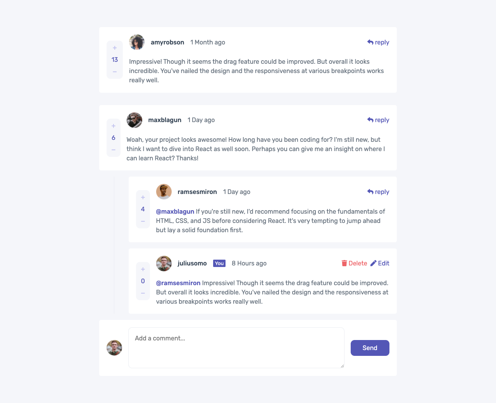

# Frontend Mentor - Interactive comments section solution

This is a solution to the [Interactive comments section challenge on Frontend Mentor](https://www.frontendmentor.io/challenges/interactive-comments-section-iG1RugEG9). Frontend Mentor challenges help you improve your coding skills by building realistic projects. 

## Table of contents

- [Overview](#overview)
  - [The challenge](#the-challenge)
  - [Screenshot](#screenshot)
  - [Links](#links)
- [My process](#my-process)
  - [Built with](#built-with)
  - [Continued development](#continued-development)
  - [Useful resources](#useful-resources)
- [Author](#author)

## Overview

### The challenge

Users should be able to:

- View the optimal layout for the app depending on their device's screen size
- See hover states for all interactive elements on the page
- Create, Read, Update, and Delete comments and replies
- Upvote and downvote comments
- **Bonus**: If you're building a purely front-end project, use `localStorage` to save the current state in the browser that persists when the browser is refreshed.
- **Bonus**: Instead of using the `createdAt` strings from the `data.json` file, try using timestamps and dynamically track the time since the comment or reply was posted.

### Screenshot

### Links

- [solution URL](https://github.com/idrissjuanito/interactive-comments)
- [live site URL](https://idrissjuanito.github.io/interactive-comments)

## my-process

### Built with

- Semantic HTML5 markup
- Sass
- Flexbox
- Vanilla Javascript
- Desktop-first workflow
- DOM
- Javascript functions, array functions and async/await

### Continued development

I am still a javascript beginner so my code structure may not be the best but will be hoping on your feedback and suggestions to help improve it. Also looking forward better css code and better class naming.

### Useful resources

- [Mozilla Development Network](https://developer.mozilla.org/en-US/docs/Web/JavaScript) - This is main resource for learning Javascript and was very useful for this challenge.

## Author

- Website - [Pro Juanito](https://www.projuanito.com)
- Frontend Mentor - [@idrissjuanito](https://www.frontendmentor.io/profile/idrissjuanito)
- Twitter - [@idrissjuanito](https://www.twitter.com/idrissjuanito)